# Initial Steps to Get Started with Treehouses
Welcome to treehouses. This is our system allowing us to share our different learning platforms via the Rasperry Pi series of single-board computer devices. Here is a quick start for interacting your Raspberry Pi with Treehouses Remote.
## Step 1
Assuming you have an Android device and/or using an Android simulator; here is the way to go about it:
Download the latest version of treehouses image [here](http://download.treehouses.io/) and burn it with [etcher](https://www.balena.io/etcher/). Once burned put your microsd card into your raspberry pi 
## Step 2
With your android device download [treehouses remote](https://play.google.com/store/apps/details?id=io.treehouses.remote). 
## Step 3
After installing it, get into your bluetooth settings and pair your system with your Raspberry Pi (optional).

 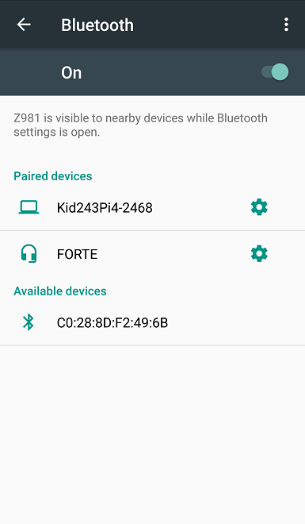

## Step 4
Once you're paired with your Raspberry Pi, open treehouses remote and connect to your Raspberry Ri.

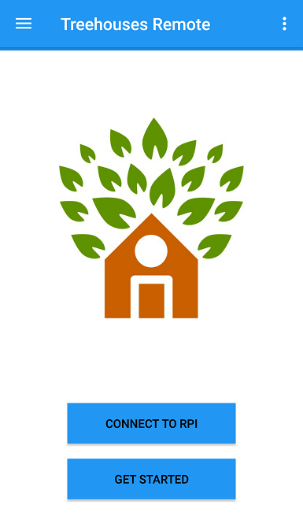 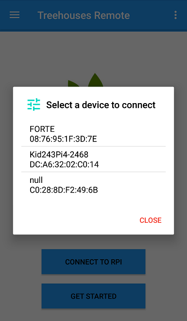

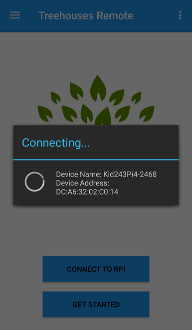 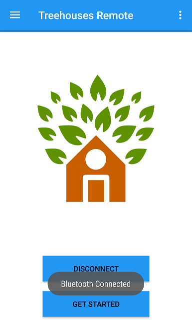

## Step 5
At the terminal we'll get into setting up a bridge and setting up a WiFi

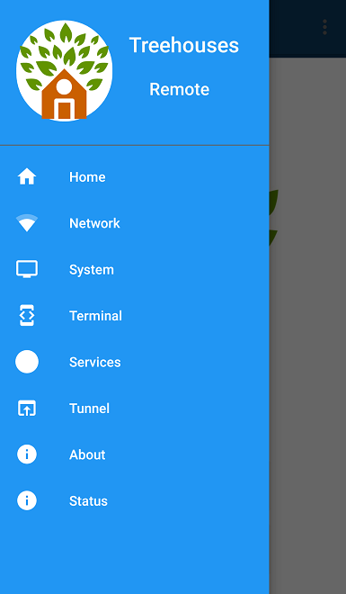 

### Setting Up WiFi
In your terminal enter "treehouses wifi <your local WiFi name> [your password]"

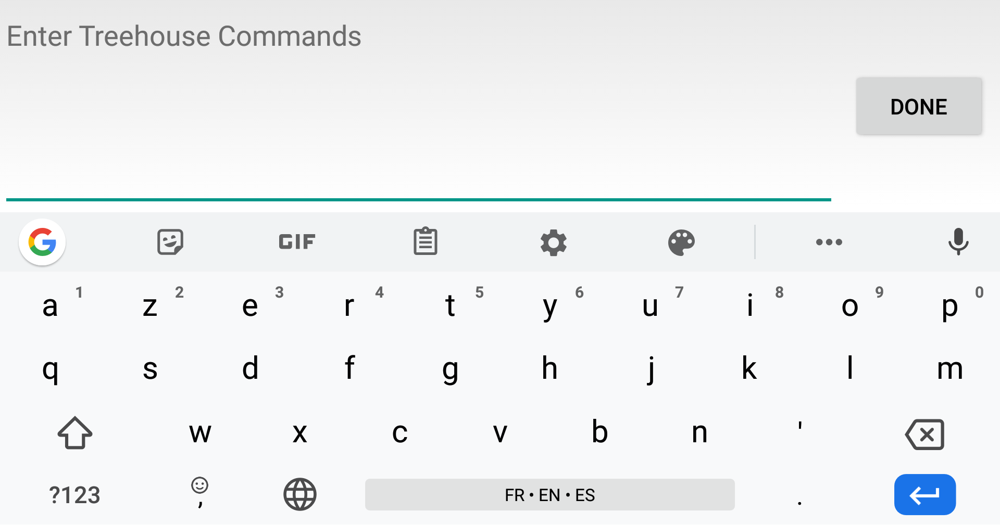

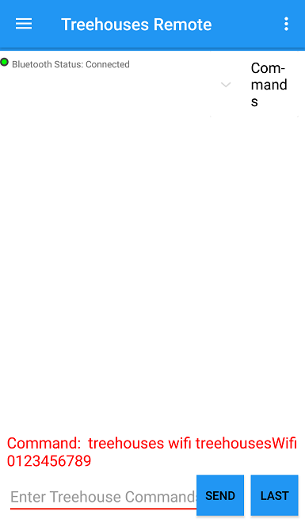 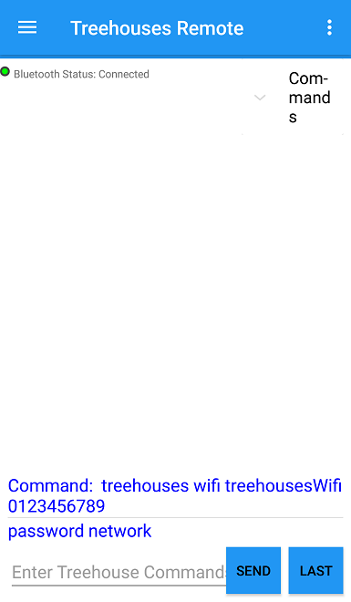

treehousesWifi would be your wifi name 0123456789 woud be your password

To verify if your raspberry pi is connected to the internet, just type "treehouses internet" into your terminal. If it returns true, it means your Raspberry Pi is connected. If it returns false, it means your Raspberry Pi is not connected to the internet. In that latter case, you should check the spelling of your WiFi name and corresponding password.

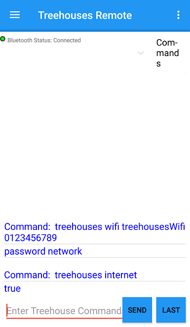

### Setting up a bridge
In your terminal, enter "treehouses bridge <your local wifi name> <the new name for your hotspot> [your wifi password] [(optional) your password for your new hotspot] "

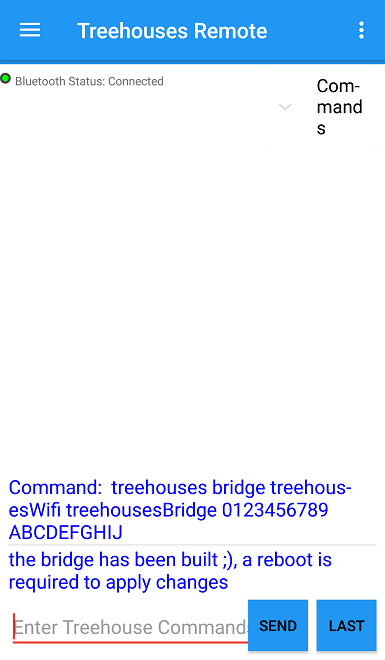

treehousesWifi would be your local wifi name; treehousesBridge would be your hotspot name; 0123456789 woud be your wifi password; optionally ABCDEFGHIJ woud be your hotspot password

After entering the command you will be asked to reboot. Just enter the command "reboot." This will disconnect your device. Wait a few moment for the device to boot up and connect like you did in Step 4.

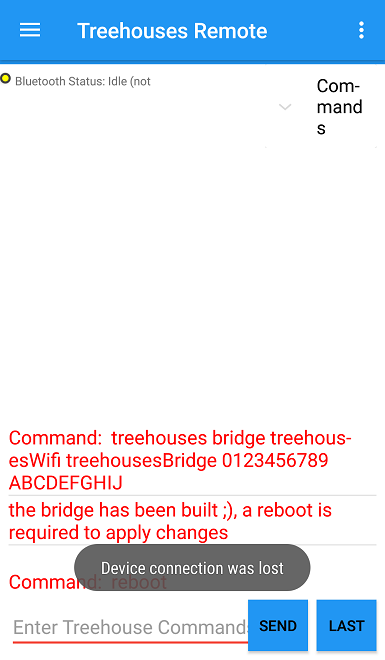

_NOTE To be certain of the network mode in which your raspberry pi is connected you can use treehouses networkmode and it should return whether your Raspberry Pi is connected via AP internet, WiFi or bridge_

## Step 6
Once you are connected to the internet, let's configure your tor access.
### Verify if tor is already configured
In the terminal, type treehouses tor to verify if you get a onion address. Normally it shouldn't and it would return this:

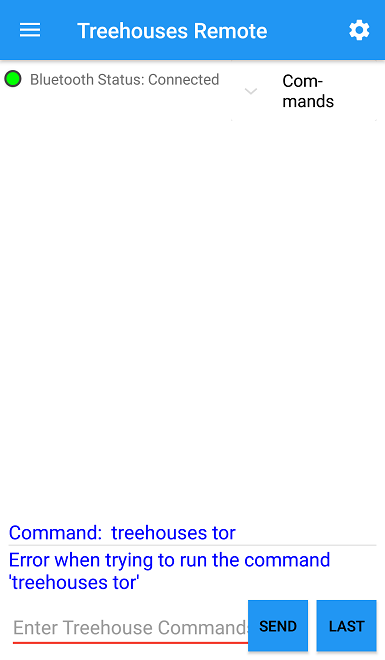

### Configure tor tunnels
 * Type treehouses tor add 22
 * Type treehouses tor list in order to verify if tor tunnel has been configured
 * Type treehouses tor add 80
 * Type treehouses tor add 2200
 * Type treehouses tor start to configure tor for your Raspberry Pi 
 * Type treehouses tor list in order to verify all tunnels have been configured

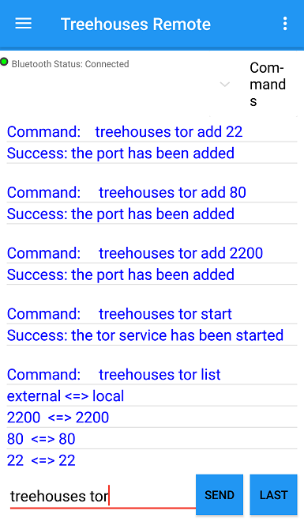

### Display your onion address
Use treehouses tor to display your onion address

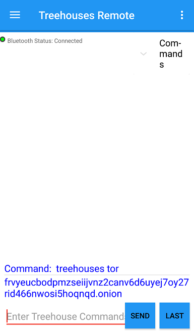                                     

Once you see the display of your onion address that concludes your 6th step.
## Step 7
In order to verify that the previous step is working, we publish the onion address on the [treehouses gitter chat](https://gitter.im/open-learning-exchange/treehouses)
Here is the command to accomplish the step:
Type treehouses tor notice now to appear in the gitter treehouses chat.

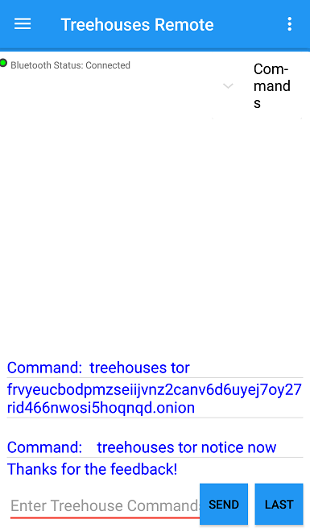

**Congrats you have successfully completed this blog session !!!**
