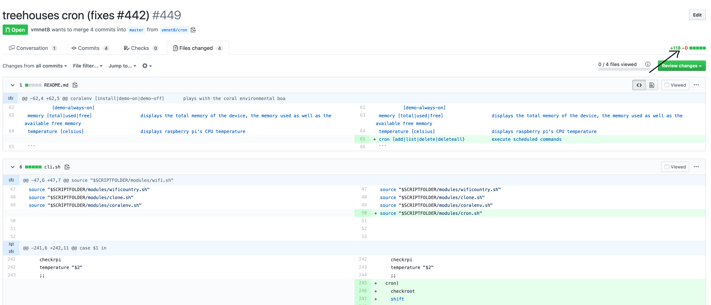
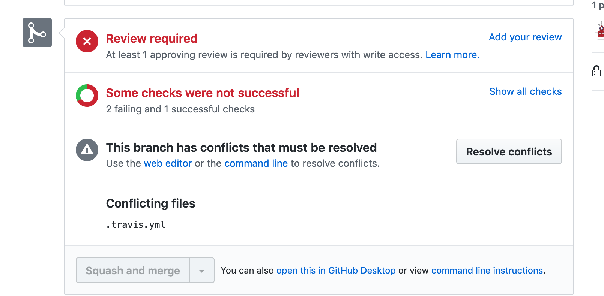
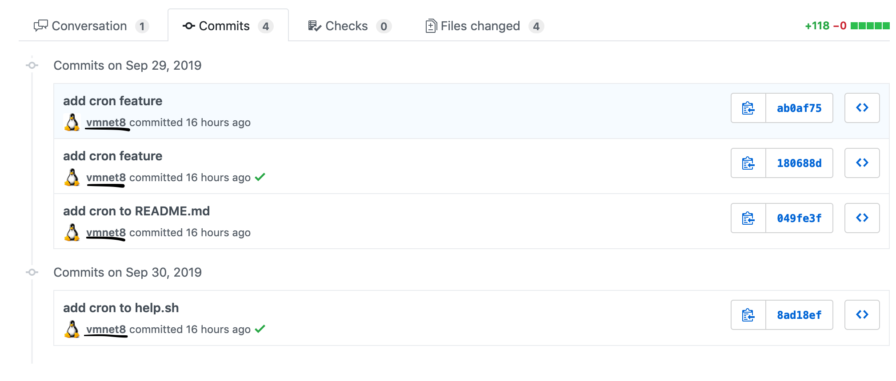
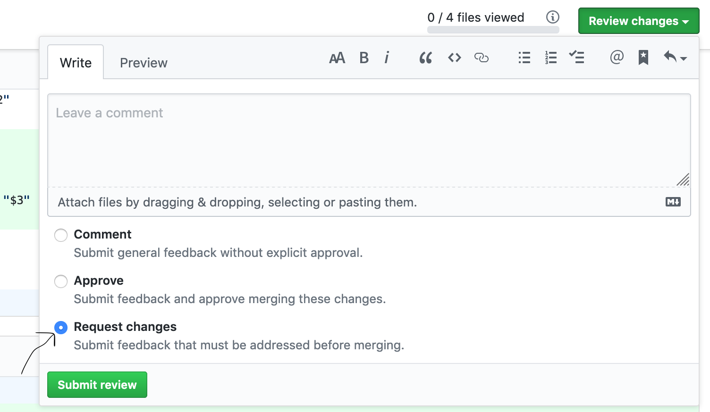
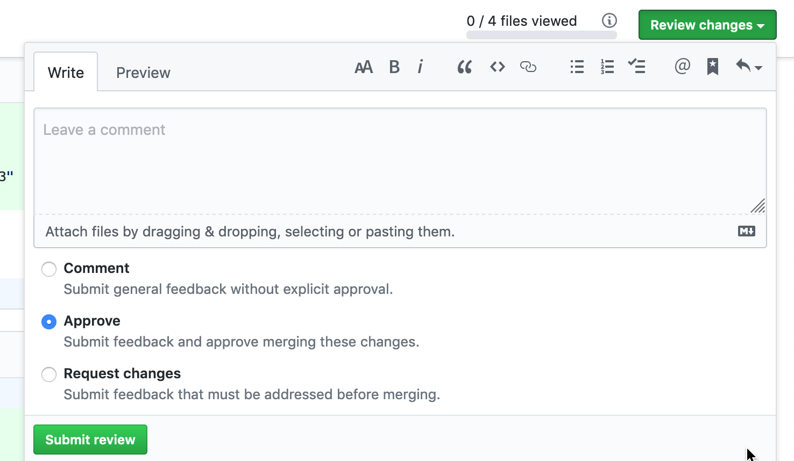

# Reviewing PRs on the CLI repository

30, September 2019 • [Xavierh93](https://github.com/xavierh93)

---

As a system's engineer you may need to work with the [treehouses cli](https://github.com/treehouses/cli) (command line interface). 

Here are step by step instructions on how to review Pull Resquests for the Treehouses CLI repository.

## Step 1: Check the pull request title and description

Make sure the issue number that the pull request is fixing is in the pull request title. An example is shown below.

_**SPECIAL NOTE:**_ **If you are in the treehouses repository:**
    Make sure the githack preview link is listed in the description. This link is how you will check that the changes are rendered correctly on the preview. The correct format is `https://raw.githack.com/{YourGitHubUsername}/{YourGitHubUsername}.github.io/{YourBranchName}/#!index.md` and viewing the pages that have been changed.

## Step 2: Verify that there is a branch for the pull request

 The pull request should have its own branch for the issue fix. You can find which branch the pull request is on right beneath the title of the pull request in the blue box.

## Step 3: There are non unnecessary file/line changes in the pull request

Click on the files changed tab beneath the branch in the previous step. On this page you can see all the changes that have been made in this pull request including all the files that were changed and every line that was added or removed from each file. Green lines indicate lines that were added while red lines indicate which lines were removed. Directly above the green "Review Changes" box is a green number that indicates how many lines were added followed by a red number that indicates how many lines were removed in total in the pull request.

_**NOTE:**_ You can change from a unfied view to a split view by clicking the gear icon located beneath the *Files Changed* tab.

## Step 4: There are no merge conflicts

If you scroll down on the main conversation page, beneath the *Review Required* there will be a Box that lets you know if there are any merge conflicts and if there is, a list of the conflicting files.

## Step 5: The Pull Request Fixes the Issue

Before you can submit your review of the pull request you must verify that it is actually fixing the issue it refers to in the title. If it is a new feature that is being added you will have to test the feature on your raspberry pi. In order to do this you will need to ssh into your raspberry pi and switch to the branch that the feature is added on via `git checkout <branchname>`.

## Step 6: The Commits are Associated with a Github Account

Click on the *Commits* tab. This will  display all the commits for this pull request. You will need to verify that all commits were made by the same Github account.

## Step 7: (Optional) Request Changes

If you find any issue that needs to be addressed with another commit, you can use the `Request Changes` option when creating your review. Make sure to leave a comment about what needs to be addressed in the change. 

## Step 8: Submit Review

If everything in the pull requests checks out submit your review and leave a comment for feedback. Make sure you click the `Approve` radio box when submitting.

